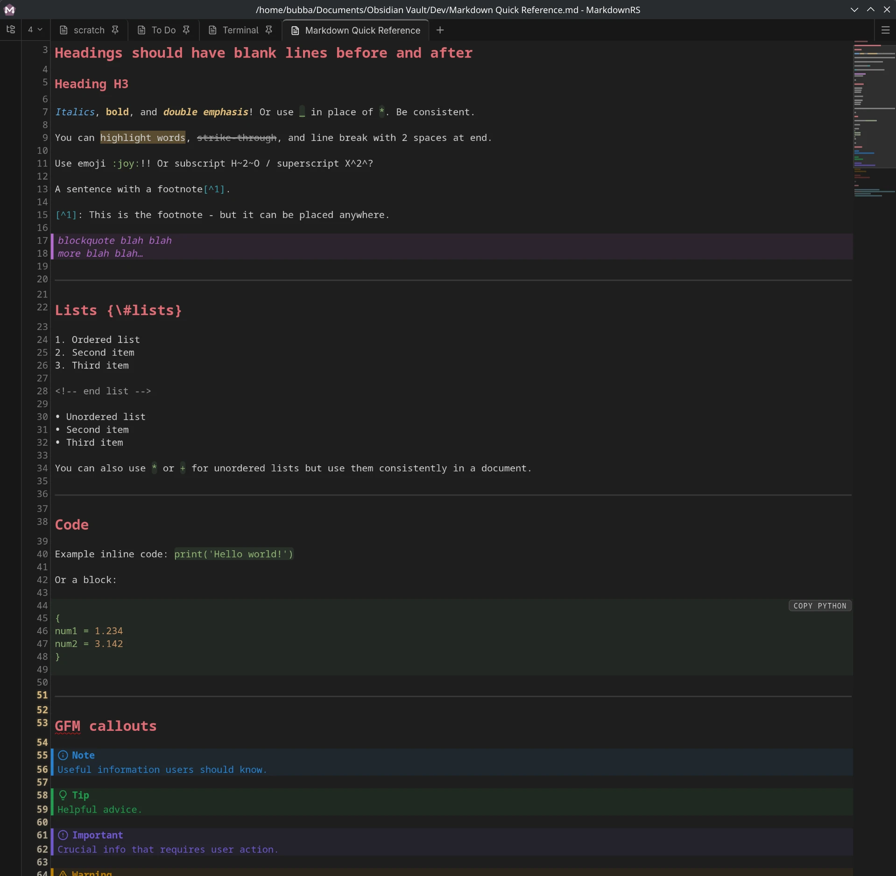

# MarkdownRS

MarkdownRS is a focused Markdown editor. It prioritises performance and a clean, minimal UI while still being fully featured for technical and general users.

[](LICENSE) [](https://github.com/dcog989/MarkdownRS/issues) [](https://github.com/dcog989/MarkdownRS/stargazers)



The only Markdown editor you need? Many people are saying so.

## Features

### Editing & Authoring

- Markdown Flavors: GFM (GitHub Flavored Markdown) and CommonMark.
- Smart Formatting: Auto-Markdown formatting for standards=compliant, consistent output.
- Text Operations: Sort lines, trim whitespace, change case, etc.
- Rendered Mode: Edit in rendered or raw Markdown mode.
- Find & Replace: Across all open documents.

### Performance & Reliability

- Fast, Low Resource Use: Built with a Rust backend for instant startup and smooth editing.
- Auto-Save: Session persistence with hot-exit support — never lose your work.

### Preview & Rendering

- Live Preview: Split view with smooth, bi-directional synchronized scrolling.
- Math (KaTeX): Render math in the preview with KaTeX.
- Diagrams (Mermaid): Render flowcharts, sequence diagrams, and more with Mermaid.js.

### Math (KaTeX)

Math renders in the preview with KaTeX. Delimiters:

| Style | Syntax |
| --- | --- |
| Inline | `$...$`, `\(...\)` |
| Display | `$$...$$`, `\[...\]`, ```` ```math ```` fence |

Math is rendered to HTML via KaTeX `renderToString` and cached by expression hash, so unchanged expressions are never re-rendered. KaTeX CSS and fonts are bundled for offline use.

### Diagrams (Mermaid)

Flowcharts, sequence diagrams, and other diagrams render in the preview from ```` ```mermaid ```` fenced blocks. Mermaid is lazy-loaded only when a diagram is present and rendered diagrams are cached by content hash, so unchanged diagrams are never re-rendered.

### Documents & Organisation

- Multi-Tab: Work on multiple documents simultaneously, pin them, bookmark them.
- File Tree: Sidebar file tree for browsing and opening files.
- Bookmark System: Bookmark and tag local documents with instant filter search.
- New File Template: Create new files from a configurable template.

### Customisation

- Command Palette: Efficient navigation with command palette (Ctrl+Shift+P).
- Keyboard Shortcuts: Customise any command's shortcut as you want.
- Themes: Multiple built-in light and dark themes, plus custom themes.

### Export

- Export your documents to PDF, PNG, WEBP, or HTML.

### Markdown Linting / Formatting

The embedded [rumdl](https://github.com/rvben/rumdl/) lints and formats Markdown content; rules can be configured with the built-in editor.

*rumdl* config files - `.rumdl.toml` or `rumdl.toml` - can be placed at project or home folder levels. If neither exists, the built-in defaults are used.

### Grammar Checking

The [Harper](https://writewithharper.com/) Grammar Check is optional and its rules can be edited in `settings.toml`:

```toml
[harperLinters]
OxfordComma = false      # disable a rule
LongSentences = true     # force a rule on
```

---

## Code / Dev Stack

Developed using the latest versions of:

- [bun](https://bun.com/)
- [Biome](https://biomejs.dev/)
- [CodeMirror](https://codemirror.net/)
- [lefthook](https://github.com/evilmartians/lefthook)
- [Node.js](https://nodejs.org/)
- [Rust](https://www.rust-lang.org/)
- [SQLite](https://sqlite.org/)
- [Svelte](https://svelte.dev/)
- [Tauri](https://v2.tauri.app/)
- [TypeScript](https://www.typescriptlang.org/)
- [Vite](https://vite.dev/)
- [Vitest](https://vitest.dev/)

## Development

```sh
bun install        # Install dependencies
bun run dev        # Run in development mode
bunx tauri build   # Build distributable bundles (.deb, .rpm, .AppImage, NSIS)
```

Arch / CachyOS package (requires `bunx tauri build` first, so the compiled binary exists):

```sh
mkdir -p .pkg && cp PKGBUILD .pkg/ && cd .pkg && makepkg -si
```

## Available Scripts

- `bun run clean` - Remove build artifacts, target, and node_modules
- `bun run check` - Full check: Svelte types, Biome lint, and cargo check + clippy
- `bun run format` - Format code with Biome + 'cargo fmt'
- `bun run update` - Update packages + crates
- `bun run dev` - Start dev server / HMR
- `bun run preview` - Preview the production build
- `bun run package` - build and install

## Contributing

[Pull Requests](https://github.com/dcog989/MarkdownRS/pulls) and [bug reports / feature requests](https://github.com/dcog989/MarkdownRS/issues) are welcomed.

## License

[MIT License](https://github.com/dcog989/MarkdownRS/blob/main/LICENSE).
